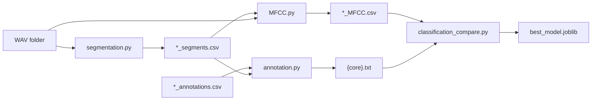
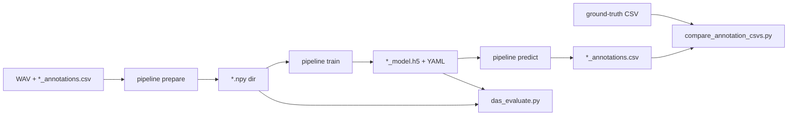

# Birdsong-project

Repository for birdsong processing and automatic annotation. Three largely independent workflows:

| Directory | Role |
|-----------|------|
| [`traditionML/`](traditionML/) | Classic pipeline: energy segmentation → MFCC features → align manual labels → sklearn classification |
| [`deepLearning/`](deepLearning/) | **DAS-inspired baseline**: self-contained frame-level TCN (prepare / train / predict), offline evaluation, and CSV comparison—covers the core [DAS](https://github.com/yardencsGitHub/DeepAudioSegmentation) workflow without the full upstream stack |
| [`post_annotation/`](post_annotation/) | **After annotations exist**: scripts that operate on cleaned `*_annotations.csv` (and clips derived from them)—label merge/cleanup, batch audio cutting, clustering, UMAP, and multi-channel song summaries |

Copy-paste commands live in [`command`](command) at the repo root. Steps below follow the recommended order; replace paths with your own data directories.

---

## 1. traditionML (MFCC + sklearn)

Run from the `traditionML/` directory (same as in `command`):

```bash
cd traditionML
```

### 1.1 Segmentation — `segmentation.py`

Energy/spectrogram segmentation for all WAVs in a folder; writes `*_segments.csv`.

```bash
python segmentation.py \
  --wav_dir "/path/to/870_songs" \
  --out_dir "/path/to/870_seg" \
  --plot
```

| Argument | Description |
|----------|-------------|
| `--wav_dir` | Input WAV directory |
| `--out_dir` | Output CSV directory (default: `<wav_dir parent>/<wav_dir name>_seg`) |
| `--strip_prefix` | Prefix stripped from filename stem (default: `"a b c d e f i "`) |
| `--plot` | Debug: show spectrogram overlay per file |

### 1.2 MFCC — `MFCC.py`

Extract MFCC from WAV using `*_segments.csv`; writes `*_MFCC.csv`.

```bash
python MFCC.py \
  --segments_dir "/path/to/870_seg" \
  --wav_dir "/path/to/870_songs" \
  --out_dir "/path/to/870_O_MFCC" \
  --strip_prefix "a b c d e f i " \
  --overwrite_segments_csv
```

### 1.3 Label alignment — `annotation.py`

Align manual `*_annotations.csv` with automatic `*_segments.csv`; one `{core}.txt` label file per recording.

```bash
python annotation.py \
  --annotated_dir "/path/to/870_O_annotated_excel" \
  --segments_dir "/path/to/870_seg" \
  --output_txt_dir "/path/to/870_O_anno_y" \
  --stats_csv /path/to/870_O_anno_y/stats.csv
```

### 1.4 Classification and model export — `classification_compare.py`

Compare SVM / RandomForest / LogisticRegression; optional CV and save best model for `model_predict.py`.

```bash
python classification_compare.py \
  --features_dir "/path/to/870_O_MFCC" \
  --labels_dir "/path/to/870_O_anno_y" \
  --test_size 0.2 \
  --random_state 42 \
  --align_mismatch pad_file_last \
  --pad_label_fill i \
  --cv_folds 5 \
  --save_model "/path/to/best_model.joblib"
```

### traditionML data flow



---

## 2. deepLearning (DAS-style frame-level TCN)

This folder is a **pared-down, repo-local implementation** of the main [Deep Audio Segmentation (DAS)](https://github.com/yardencsGitHub/DeepAudioSegmentation) ideas: turn WAV + `*_annotations.csv` into a frame-level dataset, train a TCN, and auto-label new recordings. It is not a full DAS install—training, inference, and evaluation live under `deepLearning/` with vendored helpers (`kapre`, `tcn`, `morpholayers`) so the classic `traditionML` path can stay separate.

Run from the **repository root**. See [`deepLearning/data_formats.md`](deepLearning/data_formats.md), [`deepLearning/TRAINING.md`](deepLearning/TRAINING.md), [`deepLearning/PIPELINE_FLOW.md`](deepLearning/PIPELINE_FLOW.md).

Dependencies: `tensorflow`, `librosa`, `numpy`, `pandas`, `pyyaml`, `scipy`, `tqdm`, etc. (see imports under `deepLearning/`).

### 2.1 Prepare → train → predict

```bash
# Build *.npy dataset directory
python -m deepLearning.pipeline prepare \
  --wav_dir /path/to/wavs \
  --annot_dir /path/to/annotations \
  --out_dataset /path/to/O_annotated_excel.npy \
  --strip_prefix ""

# Train TCN
python -m deepLearning.pipeline train \
  --data_dir /path/to/O_annotated_excel.npy \
  --save_dir /path/to/runs \
  --save_prefix birds_ \
  --nb_epoch 200

# Auto-label new WAVs (writes *_annotations.csv)
python deepLearning/pipeline.py predict \
  --wav_path /path/to/870_songs \
  --model_prefix /path/to/runs/20260227_184334 \
  --out_dir /path/to/online_model_pre
```

`--model_prefix` is the training run prefix (**without** `_model.h5`), e.g. `{save_dir}/{save_prefix}{timestamp}`.

### 2.2 Offline evaluation — `das_evaluate.py`

Run the model on hold-out `.npy` data; writes confusion matrix, classification report, etc. under `deepLearning/das_eval_outputs/` (or `--out-dir`).

```bash
python deepLearning/das_evaluate.py \
  --stem /path/to/runs/20260227_184334 \
  --data-dir /path/to/O_annotated_excel.npy \
  --split auto
```

| Argument | Description |
|----------|-------------|
| `--stem` | Model prefix (same as predict) |
| `--data-dir` | Override `data_dir` from training YAML |
| `--split` | `auto` (test→val→train) or `test` / `val` / `train` |

### 2.3 Predictions vs ground truth — `compare_annotation_csvs.py`

Segment IoU matching + optional frame-level metrics (`--frames`).

```bash
python deepLearning/compare_annotation_csvs.py \
  --truth /path/to/870_O_annotated_excel \
  --pred /path/to/online_model_pre \
  --iou 0.25 \
  --frames \
  --step-ms 10 \
  --export-dir /path/to/pred_eval
```

### deepLearning data flow



---

## 3. post_annotation (downstream on annotated files)

Use this folder **after** you have annotation CSVs (from manual labeling, `deepLearning` predict, or another tool). Scripts expect paths you set in each file—there is no shared CLI. They clean or recode labels, cut syllable WAVs, and run exploratory analysis (clustering, UMAP, Excel summaries).

| Script | Purpose |
|--------|---------|
| `data_prepare.py` | Batch CSV cleanup: strip `_proposals` from `name`, drop rows with 4th column -1, drop `noise` rows |
| `cannary_breed_compress.py` / `cannary_unbreed_compress.py` | Canary labels: merge/re-encode `name` column by rules |
| `cluster.py` | KMeans on cut syllable WAVs (per-label subfolders): duration, spectral centroid, etc. |
| `finch_cluster.py` / `birds_umap.py` | Finch etc.: acoustic features + UMAP (often with R-exported feature tables) |
| `songsporperity_MultiChannel_*.py` | Multi-channel SongSpor batch processing |
| `Syllable+acoustics+parameter.R` / `batchCutAudio.m` | R / MATLAB: syllable acoustics and batch audio cutting |

Typical order: finalized `*_annotations.csv` → `data_prepare.py` or breed-specific compress → `batchCutAudio.m` / pydub cutting → `cluster.py` or UMAP / Excel scripts.

---

## 4. How the pipelines fit together

- **traditionML**: Interpretable per-segment MFCC + classical classifiers; good when you already have segmentation and per-segment labels.
- **deepLearning**: DAS-style frame-level model; `pipeline predict` writes `*_annotations.csv` for the same tools as manual export.
- **post_annotation**: Further processing only once annotations (and optionally syllable clips) are ready.

Example order in [`command`](command): traditionML four steps → `das_evaluate` / `pipeline predict` / `compare_annotation_csvs` → then post_annotation scripts on the resulting CSVs and clips.

---

## 5. Other

- Root [`plot.py`](plot.py): plotting helper.
- More DL detail: [`deepLearning/README.md`](deepLearning/README.md).
