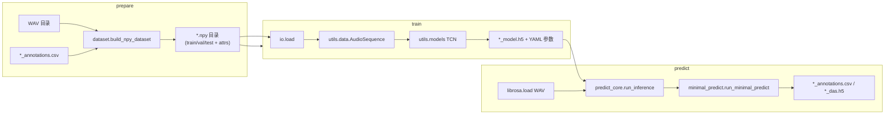

# 从输入音频到标注输出：代码全流程说明

本文说明 `deepLearning/` 下 **准备数据 → 训练 → 推理** 的调用链、张量/文件含义，以及与 DAS 上游文档的对应关系。

## 1. 总览

入口 CLI：`python -m deepLearning.pipeline prepare|train|predict`（见 `pipeline.py`）。

---

## 2. 阶段一：准备数据（音频 + CSV → `.npy` 数据集目录）

### 2.1 输入约定

- **音频**：与每条标注同“核心 id”的 `.wav`，通过 `dataset._resolve_wav_for_annotation` 与 `*_annotations.csv` 配对（支持 `strip_prefix` 前缀）。
- **标注 CSV**：文件名形如 `{core}_annotations.csv`，至少包含列：`name`、`start_seconds`、`stop_seconds`（与 `data_formats.md` / DAS GUI 导出一致）。占位行（整行 `start`/`stop` 为 NaN）会在构建矩阵时被跳过。

### 2.2 核心代码路径

| 步骤 | 文件与职责 |
|------|------------|
| 扫描 WAV–CSV 对、汇总全局类别 | `dataset.py`：`_collect_pairs`、`_global_class_names` |
| 逐条录音：读 WAV、建帧级标签矩阵 | `dataset.py`：`build_npy_dataset`；调用 `make_dataset.make_annotation_matrix` 将区间标为 1，再 `normalize_probabilities` 使每帧各类概率和为 1（含 `noise` 列） |
| 写入磁盘 | `npy_dir.py`：`save` → 目录名以 `.npy` 结尾，内含 `train/x.npy`、`train/y.npy`、`val/...`、`attrs` 等 |

### 2.3 `attrs` 与训练的关系

`build_npy_dataset` 写入的 `data.attrs` 至少包括：

- `samplerate_x_Hz` / `samplerate_y_Hz`：与 WAV 采样率一致。
- `class_names`：如 `["noise", "syllable_a", ...]`（**第 0 类为 noise**）。
- `class_types`：当前实现里**每个类都标为 `"segment"`**（音节/区间任务）；若将来需要脉冲类 `event`，需在 `dataset._global_class_names` 与下游 `minimal_predict` 的 event 分支上统一扩展。

训练时 `train_core.run_classification_training` 通过 `io.load` 读入上述结构，并把 `attrs` 合并进 `params`，供 `AudioSequence` 与模型构造使用。

---

## 3. 阶段二：训练（`.npy` → TCN → 检查点）

### 3.1 加载数据

- **`io.load(data_dir, ...)`**（`io.py`）：要求路径以 `.npy` 结尾，内部 `npy_dir.load` 得到 `DictClass`；可选 `x_suffix` / `y_suffix` 切换多组 `x`/`y`（本仓库默认数据集通常只用默认键名 `x`/`y`）。

### 3.2 训练循环

- **`train_core.run_classification_training`**（`train_core.py`）：
  - 固定 **帧分类** 分支：`with_y_hist=False`，`y_offset ≈ nb_hist/2`，`stride=1`。
  - 用 `train`/`val` 的 `x`、`y` 构造两个 `AudioSequence`（打乱/不打乱）。
  - `models.model_dict[model_name]`（默认 `tcn`）建图；`utils.save_params` 把完整 `params` 写到与权重相同前缀的 YAML。
  - `ModelCheckpoint` 保存 `save_path + "_model.h5"`（**`model_save_name` 推理时应为去掉 `_model.h5` 的前缀**）。

### 3.3 张量形状约定（与推理一致）

- `x`：`[时间采样数, 频/特征维, 通道]` 或简化为 `[T, C]`；本流水线由 `dataset` 写出时为 `[T, 1]` 单通道波形，`nb_freq` 在 `train_core` 里取自 `x.shape[1]`。
- `y`：`[T, nb_classes]`，每行对各类为概率且行和为 1。

---

## 4. 阶段三：推理（WAV → 概率序列 → 事件/片段 → CSV 或 H5）

### 4.1 编排入口

- **`predict_core.run_inference`**（`predict_core.py`）：
  1. `utils.load_model_and_params(model_save_name)` 加载 Keras 模型与 YAML `params`（须与训练时一致，含 `samplerate_x_Hz`、`nb_hist`、`class_names`、`class_types` 等）。
  2. `librosa.load` 读入 WAV，`x` 转为 `[T, channels]`（多通道会转置为时间×通道）。
  3. 对每个文件调用 **`minimal_predict.run_minimal_predict`**。

### 4.2 前向与后处理

- **`minimal_predict.run_minimal_predict`**（`minimal_predict.py`）：
  - 可选带通、**重采样到 `params["samplerate_x_Hz"]`**（与训练数据采样率一致，否则帧与时间轴错位）。
  - 按 batch 用 `AudioSequence` + `model.predict_on_batch` 得到 **帧级 `class_probabilities`，形状 `[T, nb_classes]`**（与训练 `y` 的类别维一致）。
  - **`class_names[i]` ↔ 概率矩阵第 `i` 列** 一一对应；`noise` 通常为索引 0。
  - `class_types` 中含 `"segment"` 时：`_predict_segments_numpy` 在 segment 维度上做阈值、`fill_gaps` / `remove_short`，得到 `onsets_seconds` / `offsets_seconds` / `sequence` 等。
  - 含 `"event"` 时：`_predict_events_numpy` 在对应维度上做点事件检测（本仓库 `dataset` 当前全 `segment` 时，events 字典往往为空）。

### 4.3 写回标注文件

- **CSV**：`Events.from_predict(events, segments)` → `to_df()` → `to_csv`，默认文件名 `{wav_stem}_annotations.csv`（与准备阶段输入格式兼容）。
- **H5**：`flammkuchen.save` 保存 `events`、`segments`、`class_probabilities`、`class_names` 原始结构。

---

## 5. 类别与时间轴的对应关系（小结）

| 概念 | 位置 |
|------|------|
| 类名字符串列表 | `params["class_names"]` / 数据集 `attrs["class_names"]` |
| 第 `k` 类的帧概率 | `class_probabilities[:, k]` |
| 训练目标 | `y[:, k]`，与上同行数 `T`、同采样率 |
| 输出的音节区间名 | `segments["sequence"]` 与 `segments["onsets_seconds"]` / `offsets_seconds` 对齐；合并进 CSV 的 `name` / `start_seconds` / `stop_seconds` |

---

## 6. 衔接与一致性审查（已留意或可改进处）

1. **`data_formats.md`** 部分段落沿用上游 DAS 的 `classnames` 等写法；本仓库 Python 代码与 `attrs` 使用 **`class_names` / `class_types`**（下划线），阅读时注意对照 `dataset.py` / `train_core.py`。
2. **`dataset.build_npy_dataset`** 将 **`class_types` 全部设为 `"segment"`**，与 `make_dataset.infer_class_info` 能区分 `event` 的能力未接好；若标注里存在“脉冲”类，当前不会走 event 检测分支，需后续统一设计。
3. **`pipeline.py` prepare 说明** 已与实现对齐：公开入口为 `dataset.build_npy_dataset`，其内部再调用 `make_dataset` 与 `npy_dir`。
4. **`utils/annot.py` 中 `Events.from_df`** 文档已改为列名 `stop_seconds`，与 `from_df` 实现及 CSV 列一致。

更简的训练参数说明见 `TRAINING.md`；数据布局背景见 `data_formats.md`。
